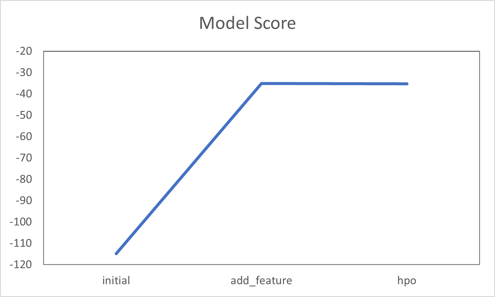
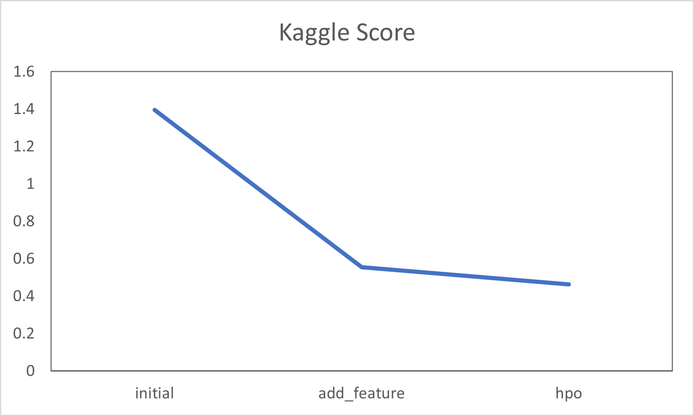

# Report: Predict Bike Sharing Demand with AutoGluon Solution
#### Shih Chieh Chen

## Initial Training
### What did you realize when you tried to submit your predictions? What changes were needed to the output of the predictor to submit your results?
The output of the predictor may contains negative numbers in the prediction. Kaggle won't alow the negative countsin the submission, so changing any negative number in the prediction to 0 is needed before the Kaggle submission. 

### What was the top ranked model that performed?
WeightedEnsemble_L3 was the top performed model.

## Exploratory data analysis and feature creation
### What did the exploratory analysis find and how did you add additional features?
The month, day and hour were in one column. By using `dt.hour`, `dt.day`, and `dt.month` to separate the hour, day and month into three new features.
The dtype of season and weather were ints initially. By using `astype('category')` function to change the dtype of these two columns.

### How much better did your model preform after adding additional features and why do you think that is?
In the initial submission to Kaggle, the score was 1.39545. After adding the new features to the training data, the score improved to 0.55464. 
Separating the datetime into hour, day and month is giving more features to have better accuracy during the model training.
Season and weather were acutally category written in int format. Using int as the data type may be miss lead while training the model. 

## Hyper parameter tuning
### How much better did your model preform after trying different hyper parameters?
Kaggle score improve to 0.46430 after hyperparater tuning.

### If you were given more time with this dataset, where do you think you would spend more time?
I will spend more time on dataset feature engineering. The improvement after feature engineering is way more than after hyperparameter tuning.

### Create a table with the models you ran, the hyperparameters modified, and the kaggle score.
|model|time_limit|num_bag_folds|num_stack_levels|hyperparameters|hyperparameter_tune_kwargs|score|
|--|--|--|--|--|--|--|
|initial|600|0|0|default|None|1.39545|
|add_features|600|0|0|default|None|0.55464|
|hpo|1800|5|3|NN, CAT, GBM tuned|auto|0.50823|

### Create a line plot showing the top model score for the three (or more) training runs during the project.

### Create a line plot showing the top kaggle score for the three (or more) prediction submissions during the project.

## Summary
The objective for this project is to predict bike sharing demand by using dataset provided in Kaggle and using AutoGluon as the solution. Overall, three model trainings were performed. Initial training was performed as default dataset without any data wrangling and without hyperparameter tuning. The model testing score after submitted to Kaggle is 1.39545. The second model training was performed with feature engineering to the training dataset. With default hyperparameters in AutoGluon, the Kaggle score improved to 0.55464 after the data wrangling. The third training is based on the second training's dataset, three hyperparameters were tuned: 1) time_limit increased from 600 to 1800; 2) num_bag_folds from 0 to 5; 3) num_stack_levels from 0 to 3; 4) Tuning hyperparameters for NN, CAT and GBM; 4) set hyperparameter_tune_kwargs to auto. After the third training, the model score only improved from 0.55464 to 0.50823. In the future, the model could be further optimize by improving the features in the training dataset.
